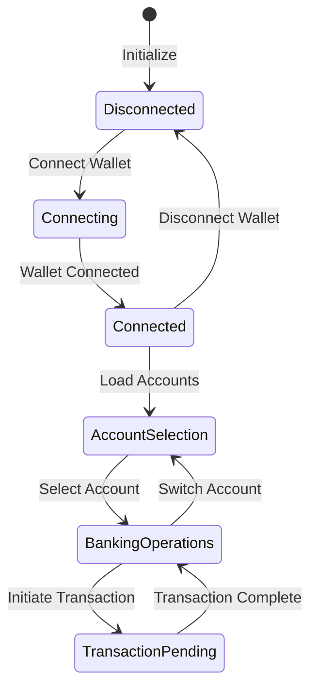
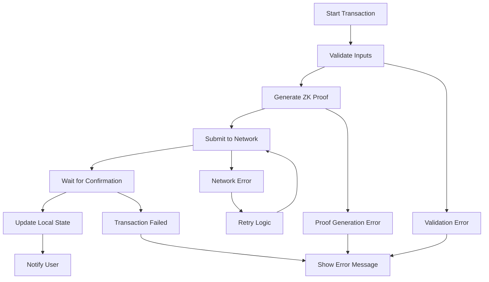

# Midnight Bank - Privacy-First Banking DApp

Welcome to **Midnight Bank** — a revolutionary decentralized banking application built on the [Midnight](https://midnight.network) blockchain with [Zero Knowledge](https://en.wikipedia.org/wiki/Zero-knowledge_proof) (ZK) capabilities. This project demonstrates how Midnight's privacy-preserving features can enable secure, confidential banking operations while maintaining regulatory compliance and transparency where needed.

## 🏦 Using the Application

The application is connected to the Midnight TestNet and provides a complete banking experience with privacy-first principles.

To use Midnight Bank, you'll need:
- The latest version of Chrome browser with the [Midnight Lace Wallet installed](https://docs.midnight.network/develop/tutorial/using/chrome-ext)
- **tDUST tokens** in your Midnight Lace Wallet for transaction fees (available from the [Midnight Network Faucet](https://midnight.network/test-faucet))

## 💰 Banking Features

### Account Management
- **Create Bank Accounts**: Deploy your own private bank contract with customizable settings
- **Multi-Account Support**: Manage multiple bank accounts from a single interface
- **Account Discovery**: Find and connect to existing bank contracts
- **Balance Privacy**: View your balance privately without exposing it to others

### Transaction Operations
- **Private Transfers**: Send and receive funds with complete privacy
- **Deposit/Withdrawal**: Add or remove funds from your accounts
- **Transaction History**: View your private transaction history
- **Real-time Updates**: Get instant notifications of account changes

### Privacy & Security
- **Zero-Knowledge Proofs**: All transactions are validated using ZK proofs
- **Confidential Balances**: Account balances remain private to the account holder
- **Selective Disclosure**: Share specific financial information with authorized parties only
- **Non-custodial**: You maintain full control of your funds at all times

## 📋 Application Overview

Midnight Bank provides a complete banking experience while leveraging Midnight's unique privacy features:

- **Privacy by Design**: All sensitive financial data is kept private using zero-knowledge proofs
- **Regulatory Compliance**: Built-in features for selective disclosure to meet compliance requirements
- **User-Friendly Interface**: Intuitive UI that makes privacy-preserving banking accessible to everyone
- **Multi-Theme Support**: Dark and light themes with consistent design language

## ✅ Key Features

- 💡 **Privacy**: Account balances and transaction details remain confidential
- 💡 **Security**: Non-custodial design ensures you always control your funds
- 💡 **Compliance**: Selective disclosure capabilities for regulatory requirements
- 💡 **Transparency**: Public verification of transactions without revealing private data
- 💡 **User Experience**: Smooth, intuitive interface with real-time updates
- 💡 **Multi-Account**: Support for multiple bank accounts and easy switching
- 💡 **Error Handling**: Comprehensive error handling with user-friendly messages
- 💡 **Theme Support**: Beautiful dark and light themes that respect user preferences

## 🛠 Technical Features

- 💡 **Smart Contracts**: Written in [Compact](https://docs.midnight.network/learn/glossary#compact) for maximum security and efficiency
- 💡 **Zero-Knowledge Proofs**: All transactions validated with ZK proofs for privacy
- 💡 **Real-time Updates**: Live updates using efficient polling mechanisms
- 💡 **State Management**: Robust state management with React Context API
- 💡 **Error Recovery**: Automatic retry logic and graceful error handling
- 💡 **Transaction Feedback**: Step-by-step transaction processing updates
- 💡 **Wallet Integration**: Seamless integration with Midnight Lace Wallet
- 💡 **Responsive Design**: Works beautifully on desktop and mobile devices
- 💡 **Type Safety**: Full TypeScript implementation for better code quality

## 📝 Smart Contract Features

- 💡 **Account Creation**: Deploy individual bank contracts for each account
- 💡 **Balance Management**: Private balance tracking with ZK proof validation
- 💡 **Transfer Logic**: Secure fund transfers between accounts
- 💡 **Access Control**: Ensure only account owners can perform operations
- 💡 **State Validation**: Comprehensive state validation to prevent tampering
- 💡 **Event Emission**: Structured events for transaction tracking
- 💡 **Gas Optimization**: Efficient contract design to minimize transaction costs
- 💡 **Upgrade Safety**: Immutable contracts ensure consistent behavior

## 🎨 Application Architecture

The Midnight Bank application is designed with modularity, security, and user experience as primary goals. The architecture leverages Midnight's unique capabilities while providing a familiar banking interface.

### Design Principles
- **Privacy First**: All sensitive data operations use zero-knowledge proofs
- **User-Centric Design**: Intuitive interface that doesn't compromise on privacy
- **Regulatory Ready**: Built-in compliance features for real-world deployment
- **Developer Friendly**: Clean, well-documented codebase for easy maintenance

### Modules

The repository contains the following modules:

1. **`bank-contract`**: Smart contract implementation for private banking operations
2. **`bank-api`**: API layer for interacting with bank contracts and the Midnight network
3. **`bank-ui`**: React-based user interface with privacy-focused design

### State Management

The application uses a sophisticated state management system:



### Transaction Flow



## 🪛 Build

### Prerequisites
- [Midnight Compact compiler 0.24.0](https://docs.midnight.network/relnotes/compact)
- [Node.js](https://nodejs.org/en/download/) (LTS version)
- [npm](https://www.npmjs.com/get-npm) or [yarn](https://yarnpkg.com/getting-started/install)

### Installation
```bash
# Clone the repository
git clone <repository-url>
cd midnight-bank

# Install dependencies
npm install

# Build all packages
npm run build
```

### Development
```bash
# Start the development server
npm run dev

# Run in specific package
cd bank-ui
npm start
```

## 🧪 Test

```bash
# Run all tests
npm test

# Run tests in watch mode
npm run test:watch

# Run contract tests
cd bank-contract
npm test

# Run API tests
cd bank-api
npm test

# Run UI tests
cd bank-ui
npm test
```

## 💻 Local Development

### Configure for Local Network
Update the network configuration in `bank-ui/public/config.json`:
```json
{
  "NETWORK_ID": "Undeployed",
  "NODE_URL": "http://localhost:8080"
}
```

### Run Local Midnight Network
```bash
# Start local Midnight network
docker compose up midnight-node

# Deploy contracts
npm run deploy:local

# Start the application
npm run dev
```

### Wallet Configuration
1. Open Midnight Lace Wallet
2. Go to **Settings** → **Networks**
3. Add or switch to **Undeployed** network
4. Import test accounts if needed

## 🔧 Configuration

### Environment Variables
Create a `.env` file in each package directory:

```bash
# bank-ui/.env
REACT_APP_NETWORK_ID=testnet
REACT_APP_NODE_URL=https://testnet.midnight.network

# bank-api/.env
MIDNIGHT_NODE_URL=https://testnet.midnight.network
LOG_LEVEL=info
```

### Network Configuration
The application supports multiple network configurations:
- **Testnet**: For testing with real network conditions
- **Undeployed**: For local development
- **Mainnet**: For production deployment (when available)

## 📚 Documentation

- [Midnight Documentation](https://docs.midnight.network)
- [Compact Language Guide](https://docs.midnight.network/learn/compact)
- [Lace Wallet Setup](https://docs.midnight.network/develop/tutorial/using/chrome-ext)
- [Zero-Knowledge Proofs Explained](https://en.wikipedia.org/wiki/Zero-knowledge_proof)

## 🤝 Contributing

We welcome contributions to Midnight Bank! Please read our contributing guidelines and submit pull requests for any improvements.

### Development Guidelines
- Follow TypeScript best practices
- Write comprehensive tests for new features
- Ensure all privacy features are properly implemented
- Update documentation for any API changes

## 📄 License

This project is licensed under the Apache License 2.0 - see the [LICENSE](LICENSE) file for details.

## 🙏 Acknowledgments

- [Midnight Network](https://midnight.network) for the privacy-preserving blockchain infrastructure
- [Input Output Global](https://iohk.io) for developing the Midnight ecosystem
- The zero-knowledge cryptography community for advancing privacy technology

## 🔗 Links

- [Midnight Network](https://midnight.network)
- [Midnight Documentation](https://docs.midnight.network)
- [Midnight Faucet](https://midnight.network/test-faucet)
- [Lace Wallet](https://www.lace.io)

---

*Built with ❤️ for financial privacy and freedom*
